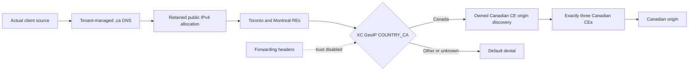
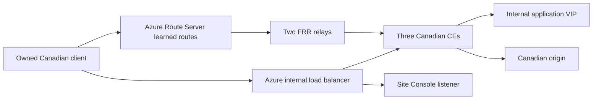

## Three decisions in the public path

The RE virtual site selects exactly `tr2-tor` and `mtl7-mon`. Public traffic uses the retained allocation; the CE origin pool selects only the three owned Canadian sites. The load balancer explicitly selects the owned country policy. Unknown classifications are denied.

## Internal routing and console path

The internal diagnostic hostname is separate from public advertisement. Expect six CE-to-FRR and four FRR-to-Route-Server sessions, with both FRR next hops in the client effective routes. The application ILB and console listener use distinct frontend outputs; do not confuse an internal VIP with the retained public allocation.

Origin ingress is the union of provider-published RE/CDN CIDRs, authorized workstation /32s, and exact owned Canadian probe sources. This infrastructure-source allowlist permits origin delivery and diagnostics; public GeoIP authorization applies separately at the public load balancer.

The independent Canada state lives in protected workstation storage. MCN state and the shared Marketplace prerequisite are outside Canada's ownership. See [deployment](../deployment/) for registration phases and [failover](../failover/) for node recovery.
