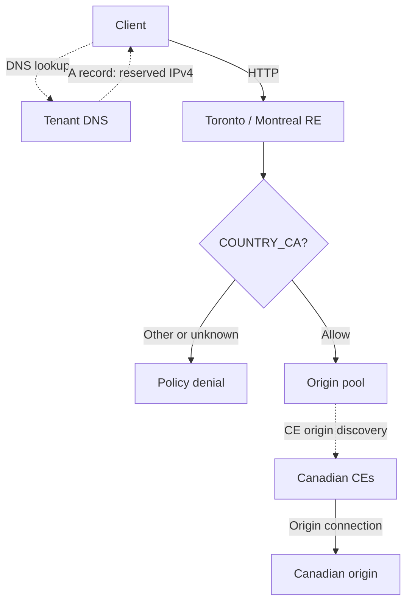

## Purpose and design

An application can use Canadian origins, expose its public listener on Canadian Regional Edges (REs), and authorize clients classified as Canadian. These are three separate
configuration decisions. Origin placement selects where the application runs. Advertisement selects where the public allocation is served. A service policy decides which client
sources may reach the application.

This use case is for existing F5 Distributed Cloud (XC) users adapting those controls to their own configuration. Canada Topology demonstrates them with three Customer Edges (CEs) in Azure Canada Central, Toronto/Montreal RE advertisement, and an HTTP listener. Terraform stages the demonstration; the API configuration below explains the pattern.



The sections follow a request's path. Object creation dependencies differ: for example, a load balancer references an existing pool and policy. Every JSON block is a configuration
**excerpt**, not a complete create request. Synthetic names are consistent across excerpts; `canada.example.com`, `203.0.113.10`, and `198.51.100.20` are reserved examples. Replace
them with your own authorized configuration.

## DNS → public listener

DNS connects the application name to its reserved public allocation. In the demonstration, the tenant's DNS provider owns the A record; the HTTP load balancer does not manage it.

A record in the tenant-managed zone, expressed as a provider-neutral JSON excerpt:

```json
{
  "name": "canada.example.com",
  "type": "A",
  "ttl": 300,
  "value": "203.0.113.10"
}
```

HTTP load balancer `canada-app` in application namespace `example`, spec excerpt:

```json
{
  "domains": ["canada.example.com"],
  "http": {
    "port": 80,
    "dns_volterra_managed": false
  }
}
```

`domains` identifies the listener's application hostname. `port` selects HTTP on port 80. `dns_volterra_managed: false` matches the tenant-managed A record and avoids asking XC to
manage that name. DNS ownership is a creation-time choice: the API marks this field immutable, so changing it requires replacing the load balancer. Plan that replacement alongside
DNS and traffic continuity.

The demonstration uses an F5-owned `.ca` name. A `.ca` suffix conveys naming context; it does not constrain origin location, listener placement, or client geography. DNS resolution proves name-to-address mapping only. No public AAAA record is demonstrated because equivalent IPv6 policy enforcement has not been qualified.

See the official [HTTP load balancer configuration](https://docs.cloud.f5.com/docs-v2/multi-cloud-app-connect/how-to/load-balance/create-http-load-balancer) for DNS options and listener configuration. The equivalent Terraform is in [main.tf](../terraform/#maintf).

## Load balancer → regional advertisement

The reserved allocation is bound to an RE virtual site. That site's selector determines where the allocation is available; the load balancer then advertises its listener using the allocation reference.

Virtual site `canada-re` in the allocation's platform namespace `system`, spec excerpt:

```json
{
  "site_type": "REGIONAL_EDGE",
  "site_selector": {
    "expressions": ["ves.io/region in (ves-io-toronto, ves-io-montreal)"]
  }
}
```

Existing public-IP allocation `canada-public-ip` in `system`, replacement-spec excerpt:

```json
{
  "virtual_sites": [
    {"name": "canada-re", "namespace": "system"}
  ]
}
```

Load balancer `canada-app`, spec excerpt:

```json
{
  "advertise_custom": {
    "advertise_where": [
      {
        "advertise_on_public": {
          "public_ip": {"name": "canada-public-ip", "namespace": "system"}
        },
        "use_default_port": {}
      }
    ]
  }
}
```

`site_type` restricts selection to REs. The `ves.io/region` expression selects Toronto and Montreal; the demonstration checks selectees `tr2-tor` and `mtl7-mon`. `virtual_sites`
binds the existing allocation to that selector. The allocation's address is assigned by the platform; it is not set in this replacement spec. A real replacement request also needs
its metadata and current concurrency token.

`advertise_on_public.public_ip` references that allocation by name and namespace. `use_default_port` uses the listener's configured port. This placement controls the public entry
points serving the allocation. It does not authorize clients, place origins, or establish where all telemetry, control-plane processing, and support activity occur. The public
listener has no CE BGP, primary-IP, or ILB advertisement; those belong to a separate internal diagnostic listener.

See the official [virtual-site concept](https://docs.cloud.f5.com/docs-v2/platform/concepts/site#virtual-site) for label-based selection. [main.tf](../terraform/#maintf) contains the RE selector, public-IP binding, and public advertisement references.

## Load balancer → client authorization

A client can reach a Canadian listener from anywhere. An explicitly selected service policy restricts access according to XC's classification of the actual source address.

Load balancer `canada-app`, spec excerpt:

```json
{
  "active_service_policies": {
    "policies": [
      {"name": "canada-only", "namespace": "example"}
    ]
  },
  "disable_trust_client_ip_headers": {}
}
```

Service policy `canada-only` in `example`, spec excerpt:

```json
{
  "any_server": {},
  "allow_list": {
    "country_list": ["COUNTRY_CA"],
    "default_action_deny": {}
  }
}
```

`active_service_policies.policies` explicitly selects the policy for this load balancer. It uses neither namespace-inherited policies nor the `no_service_policies` choice.
`any_server` makes the policy applicable to any server within its application scope. `country_list` admits sources classified as Canada; `default_action_deny` rejects sources that
do not match, including unknown classifications. No IP, ASN, workstation, or probe exceptions are added.

`disable_trust_client_ip_headers` is an empty-object selection that disables forwarding-header trust. Supplied `X-Forwarded-For`, `Forwarded`, and `X-Real-IP` values therefore
cannot replace the actual source used for this decision. A VPN or proxy changes the source seen by XC to its egress address: a user abroad using Canadian egress may be allowed,
while a user in Canada using foreign egress may be denied. Country classification describes that network address, not a person's location, citizenship, or entitlement.

Consult the official [service-policy guidance](https://docs.cloud.f5.com/docs-v2/multi-cloud-app-connect/how-to/app-security/service-policy) for policy configuration. The selected policy, its default action, and header-trust setting appear together in [main.tf](../terraform/#maintf).

## Origin pool → Canadian origin

An allowed request uses the load balancer's default pool. The pool discovers its endpoint through the Canadian CE virtual site, keeping discovery tied to the owned Canadian sites.

Load balancer `canada-app`, spec excerpt:

```json
{
  "default_route_pools": [
    {
      "pool": {"name": "canada-origin", "namespace": "example"},
      "weight": 1,
      "priority": 1
    }
  ]
}
```

Origin pool `canada-origin` in `example`, spec excerpt:

```json
{
  "origin_servers": [
    {
      "private_ip": {
        "ip": "198.51.100.20",
        "outside_network": {},
        "site_locator": {
          "virtual_site": {"name": "canada-ce", "namespace": "example"}
        }
      }
    }
  ],
  "port": 80,
  "no_tls": {},
  "loadbalancer_algorithm": "ROUND_ROBIN",
  "endpoint_selection": "DISTRIBUTED"
}
```

CE virtual site `canada-ce` in `example`, spec excerpt:

```json
{
  "site_type": "CUSTOMER_EDGE",
  "site_selector": {
    "expressions": ["canada-topology in (canada)"]
  }
}
```

`default_route_pools.pool` names the destination for requests without a more specific route. The single pool has weight and priority 1. `private_ip.site_locator.virtual_site`
selects the CEs that discover the endpoint; `outside_network` selects their outside network. Despite the API field name `private_ip`, this demonstrated origin uses the Canadian
VM's public address discovered through the CEs. The endpoint address alone does not prove hosting location; Azure placement and the CE inventory provide that evidence.

`port` and `no_tls` describe the demonstration's HTTP origin connection. `ROUND_ROBIN` and `DISTRIBUTED` select pool behavior. The CE selector matches the owned `canada-topology` label; its observed inventory contains exactly three Canadian CEs. Labels are an ownership/discovery control, so check their actual selectees alongside deployment placement.

The origin VM also has an infrastructure ingress ACL. Its permitted sources are the provider-published RE/CDN CIDRs plus exact authorized infrastructure and probe addresses; origin
SSH stays disabled. This ACL permits delivery infrastructure to reach the VM. It does not classify end users and must not be used as an exception to the public country policy. An
overbroad origin ACL can expose a path around the listener even when its policy is correct.

The official [origin-pool guidance](https://docs.cloud.f5.com/docs-v2/multi-cloud-app-connect/how-to/app-networking/origin-pools) covers discovery choices. See [main.tf](../terraform/#maintf) for pool and CE references, and [origin.tf](../terraform/#origintf) for the origin and infrastructure ACL.

## Checking the controls

Each observation establishes a different boundary. Record the source and configuration being tested; a successful request cannot prove all the controls by itself.

| Check | Observe | What the result proves |
| --- | --- | --- |
| DNS resolution | The application A record resolves to the retained allocation; public AAAA is absent | The intended name maps to this demonstrated IPv4 listener |
| Regional selectees | Allocation binding and RE virtual-site inventory contain the intended Toronto/Montreal sites | The allocation is configured on those REs |
| Canadian success | XC classifies the observed egress as `CA`; the allowed response matches the origin control body | That classified source reached the expected origin through the tested listener |
| Classified non-Canadian denial | A source classified outside Canada receives denial with a matching XC policy event | The selected country policy denied that actual source |
| Forwarding-header spoofing | The same non-Canadian source remains denied when each forwarding header claims Canadian egress | Supplied headers do not override actual-source authorization |
| Origin identity | Public response matches the Canadian origin; pool/CE inventory and Azure placement agree | The tested application path uses the intended Canadian origin |
| Node recovery | Owned CE and FRR node withdrawal changes routes; traffic uses surviving paths; sessions return after restart | The deployed Canada Central topology supports the exercised node recovery |

A denial without a policy event could have another cause. A regional response header shows the serving RE for that request, while the selector inventory establishes the configured set. Read the [test reference](../verification/) for the supplied verification tools and the [recovery reference](../failover/) for the exercise's scope.

## Adapting the pattern

For another country or region, change origin placement, the RE selector, and the country policy deliberately as separate decisions. Check available RE labels and CE selectees
rather than inferring them from names. Decide whether the authorized population is represented adequately by source-country classification; GeoIP data can be inaccurate or stale,
and VPNs, proxies, mobile networks, and unknown classifications affect results.

For HTTPS, follow the certificate and HTTPS options in the official [HTTP load balancer configuration](https://docs.cloud.f5.com/docs-v2/multi-cloud-app-connect/how-to/load-balance/create-http-load-balancer). Account for certificate ownership, validation, renewal, DNS requirements, and origin TLS. This article's HTTP fragments are not an HTTPS configuration.

Maintain the origin ACL as infrastructure ranges and authorized probe sources change. Use the provider-published ranges and the current owned inventory; avoid broadening client authorization to accommodate a diagnostic source. Separately qualify IPv6 before publishing an AAAA record.

Choose topology according to availability needs. Canada Topology's three CEs and two FRR relays exercise node recovery within Canada Central. Canada East is an allowed placement in
the source, not a deployed recovery region. Cross-region redundancy requires a separate design and test. Canadian origins, Canadian advertisement, and source-country authorization
alone do not establish comprehensive data residency or legal compliance.
